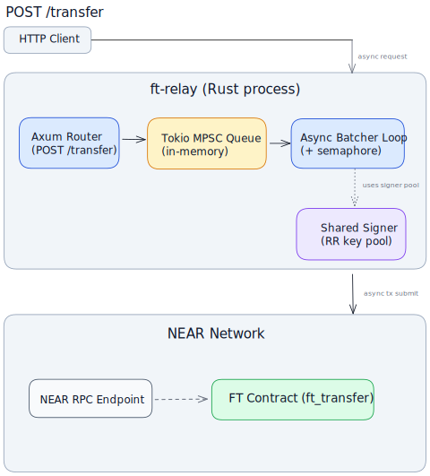

# FT Relay

A Rust-powered HTTP relay that batches NEP-141 `ft_transfer` calls into NEAR transactions. Designed for high-volume fan-in of fungible token transfers with a simple, idempotent HTTP API and a durable Redis-backed pipeline.

## Features
- Idempotent HTTP ingestion – clients must provide `X-Idempotency-Key`, used as the stable `transfer_id`.
- Registration, transfer, and verification workers (Redis Streams + consumer groups).
- Micro-batching – up to 100 `ft_transfer` actions per transaction (3 Tgas per action, under NEAR’s 300 Tgas limit).
- Signer key pool with nonce management backed by Redis.
- Durable state and event logs in Redis with 24h TTL.
- Docker and docker-compose ready; near-sandbox integration tests and benchmarks.

## Architecture


- HTTP handler persists each request and enqueues it into Redis Streams.
- Registration worker batches `storage_deposit` for unregistered receivers.
- Transfer worker batches `ft_transfer` actions and submits a single NEAR transaction.
- Verification worker confirms or requeues transfers based on final chain outcome.
- Nonces and access key leases are coordinated via Redis.

## Prerequisites
- Rust 1.86+
- Redis 8+
- NEAR RPC URL (sandbox/testnet/mainnet)
- Optional for tests: near-sandbox (tests will fetch and run it)

## Quickstart
1) Configure
```bash
cp .env.example .env
# Set ACCOUNT_ID, PRIVATE_KEYS, RPC_URL, REDIS_URL (optional), etc.
```

2) Run
```bash
cargo run --release -- --token your-ft-contract.testnet
# Or export TOKEN=your-ft-contract.testnet and run without the flag
```
By default binds to `0.0.0.0:8080` (override via `BIND_ADDR`).

3) Try it
```bash
curl -X POST http://localhost:8080/v1/transfer \
  -H 'Content-Type: application/json' \
  -H 'X-Idempotency-Key: <your-unique-id>' \
  -d '{"receiver_id":"alice.testnet","amount":"1000000000000000000"}'
```

Example response (201):
```json
{
  "transfer_id": "00000000-0000-0000-0000-000000000000",
  "status": "QUEUED_REGISTRATION",
  "receiver_id": "alice.testnet",
  "amount": "1000000000000000000",
  "created_at": "2024-10-11T00:00:00Z",
  "retry_count": 0
}
```

Poll status:
```bash
curl http://localhost:8080/v1/transfer/00000000-0000-0000-0000-000000000000
```

Health:
```bash
curl http://localhost:8080/health
```

## Configuration
You can set these via environment variables; `--token` CLI flag or `TOKEN` env is required for the FT contract.

Required:
- ACCOUNT_ID – NEAR account that owns the function-call keys
- PRIVATE_KEYS – Comma-separated ed25519 secret keys for ACCOUNT_ID (use function-call restricted keys)
- RPC_URL – NEAR RPC endpoint (sandbox/testnet/mainnet)
- TOKEN – FT contract account (or pass via `--token`)

Optional:
- BIND_ADDR – HTTP bind address (default: `0.0.0.0:8080`)
- REDIS_URL – Redis connection string (default: `redis://127.0.0.1:6379`)
- BATCH_LINGER_MS – Max wait for batch fill in ms (default: `20`)
- TRANSFER_WORKERS – Number of transfer workers (default: `1`)
- REGISTRATION_WORKERS – Number of registration workers (default: `1`)
- VERIFICATION_WORKERS – Number of verification workers (default: `1`)
- RUST_LOG – e.g., `info,ft_relay=info,near_api=warn`

Environment label used in Redis keys is inferred from `TOKEN`:
- `*.testnet` → `testnet`
- `*.near` → `mainnet`
- otherwise → `sandbox`

## API
- POST `/v1/transfer`
  - Headers: `X-Idempotency-Key` (required)
  - Body: `{"receiver_id":"<account>", "amount":"<yocto>"}` (no memo support)
  - 201 with `TransferResponse` on accept; 400 if header/body invalid

- GET `/v1/transfer/{id}`
  - Returns the current `TransferResponse` (may include `events`)

- GET `/health`
  - Returns Redis status and metrics like `rpc_calls_total`

Status lifecycle:
`RECEIVED` → `QUEUED_REGISTRATION` → `REGISTERED` → `QUEUED_TRANSFER` → `SUBMITTED` → `QUEUED_VERIFICATION` → `COMPLETED` (or `FAILED`).

Events are stored per transfer with a 24h TTL.

## Batching and Gas
- `FT_TRANSFER_GAS_PER_ACTION = 3 Tgas`, `STORAGE_DEPOSIT_GAS_PER_ACTION = 5 Tgas`
- Up to 100 transfer actions per transaction; linger (`BATCH_LINGER_MS`) controls batching latency/throughput.

## Docker
docker-compose:
```bash
docker-compose up --build
# relay at :8080, Redis at :6379
```
Image entrypoint:
```bash
docker run --rm -p 8080:8080 --env-file .env \
  ghcr.io/your-org/ft-relay:latest --token your-ft-contract.testnet
```

## Testing
Run tests serially (avoid Redis/sandbox conflicts):
```bash
cargo test --all --locked -- --test-threads=1 --nocapture
```
Ignored integration/benchmark tests:
```bash
cargo test --all --locked -- --ignored --nocapture --test-threads=1
```

## Troubleshooting
- 400 Missing `X-Idempotency-Key` – the header is required; do not reuse keys across distinct transfers.
- Nonce/key contention – add more keys to `PRIVATE_KEYS` or ensure the signer account isn’t used elsewhere.
- Redis connectivity – verify `REDIS_URL`; the server relies on Redis (no fallback).
- Use function-call restricted keys to limit blast radius.

Security note: Never ship full-access keys in production; restrict to the FT contract’s methods.
