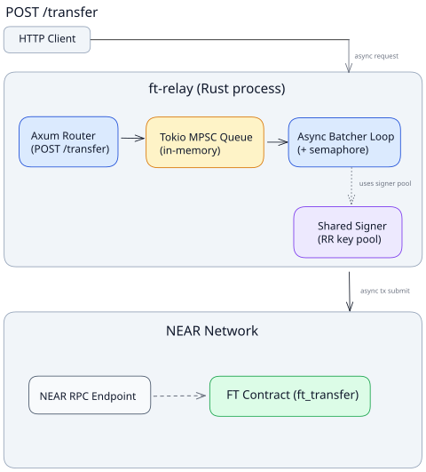

# FT Relay

A Rust-powered HTTP relay that batches NEP-141 `ft_transfer` calls into NEAR transactions. Use it whenever you need to fan-in high volumes of fungible token transfers onto NEAR with a simple HTTP interface.

---

## Features

- **Transfer endpoints** – `POST /v1/transfer` to queue transfers, `GET /v1/transfer/:id` to check status and get tx_hash.
- **Transfer audit log** – Every transfer persists its full event timeline (RECEIVED → QUEUED → SUBMITTED → COMPLETED/FAILED). `GET /v1/transfer/:id` returns the log for audit/compliance workflows.
- **Signer pool** – rotate across multiple function-call access keys to avoid nonce contention.
- **Micro-batching** – pack up to `BATCH_SIZE` transfers into a single transaction while respecting the 300 TGas ceiling.
- **Async pipeline** – bounded queue + semaphore to backpressure inflight batches.
- **Durable queue** – Redis Streams persist every transfer until the worker acknowledges it.
- **Sandbox-friendly** – integration suites spin up `near-sandbox`, deploy the FT contract, and verify final balances.
- **Docker-ready** – minimal two-stage container for production deployment.

---

## Architecture at a Glance



- The HTTP handler writes each request to a Redis Stream and immediately returns a `transfer_id`.
- Redis persists the transfer state plus an append-only event list so every status request returns a complete audit timeline (with timestamps, tx hashes, and failure reasons).
- The async worker consumes from the stream’s consumer group, batches transfers, and submits NEAR transactions.
- Gas accounting ensures we never exceed NEAR’s 300 TGas prepaid limit (`90` transfers × `40 TGas`).
- The signer pool is backed by `near-api-rs` and can host multiple secret keys for high concurrency.

---

## Prerequisites

- [Rust](https://www.rust-lang.org/tools/install) 1.86 (pinned in CI).
- `near-sandbox` dependencies (the integration tests download and run it automatically).
- [Redis](https://redis.io/) 8 or newer, reachable from the relay.

---

## Getting Started

1. **Clone and configure**

   ```bash
   git clone https://github.com/r-near/ft-relay.git
   cd ft-relay

   cp .env.example .env
   # edit ACCOUNT_ID, PRIVATE_KEYS, RPC_URL, batching knobs
   ```

2. **Run the relay**

   ```bash
   cargo run --release -- \
     --token your-ft-contract.testnet
   ```

   The server listens on `0.0.0.0:8080` unless you set `BIND_ADDR`.

3. **Send a transfer**

  ```bash
  curl -X POST http://localhost:8080/v1/transfer \
    -H 'Content-Type: application/json' \
    -H 'X-Idempotency-Key: demo-transfer-0001' \
    -d '{"receiver_id":"alice.testnet","amount":"1000000000000000000"}'
  ```
  Responses include a durable identifier (your idempotency key), the initial status, and timestamps:

  ```json
  {
    "transfer_id": "demo-transfer-0001",
    "status": "QUEUED_REGISTRATION",
    "receiver_id": "alice.testnet",
    "amount": "1000000000000000000",
    "created_at": "2025-02-20T12:34:56.789Z",
    "retry_count": 0
  }
  ```

  When you later poll `GET /v1/transfer/{transfer_id}` the response contains the current status plus the complete audit log (`events`) describing every state transition, tx hash, and failure reason recorded so far.

---

## Configuration (.env)

All configuration except the FT contract ID comes from environment variables. The CLI flag `--token` remains mandatory so you can point the same deployment at different contracts.

| Variable               | Required | Description                                                                                           |
| ---------------------- | -------- | ----------------------------------------------------------------------------------------------------- |
| `ACCOUNT_ID`           | Required | NEAR account that owns the function-call access keys.                                                 |
| `PRIVATE_KEYS`         | Required | Comma-separated list of ed25519 secret keys (`ed25519:...`). Use multiple keys for higher throughput. |
| `RPC_URL`              | Required | NEAR RPC endpoint (sandbox/testnet/mainnet).                                                          |
| `BIND_ADDR`            | Optional | HTTP bind address (`0.0.0.0:8080` by default).                                                        |
| `BATCH_SIZE`           | Optional | Max logical transfers per batch (default `90`).                                                       |
| `BATCH_LINGER_MS`      | Optional | Max time to wait for a batch to fill (default `20ms`).                                                |
| `MAX_INFLIGHT_BATCHES` | Optional | Inflight batch semaphore (default `200`).                                                             |
| `RUST_LOG`             | Optional | Standard Rust logging spec (`info,ft_relay=info`).                                                    |
| `REDIS_URL`            | Optional | Connection string for Redis (default `redis://127.0.0.1:6379`).                                       |
| `REDIS_STREAM_KEY`     | Optional | Stream key for pending transfers (default `ftrelay:pending`).                                        |
| `REDIS_CONSUMER_GROUP` | Optional | Consumer group name used by the batch worker (default `ftrelay:batcher`).                             |

> Warning: Use function-call restricted keys that can only call your FT contract. Never ship full-access secrets in production.

---

## API Reference

### `POST /v1/transfer`

Queue a new FT transfer and receive an immediately auditable record for that transfer.

**Headers**

- `X-Idempotency-Key` (required) – becomes the `transfer_id` you poll later.

**Body**

```json
{
  "receiver_id": "alice.testnet",
  "amount": "1000000000000000000"
}
```

- `receiver_id` – NEAR account that will receive tokens. Unregistered accounts are registered automatically.
- `amount` – Stringified yocto-token amount.

**Response**

```json
{
  "transfer_id": "demo-transfer-0001",
  "status": "QUEUED_REGISTRATION",
  "receiver_id": "alice.testnet",
  "amount": "1000000000000000000",
  "created_at": "2025-02-20T12:34:56.789Z",
  "retry_count": 0
}
```

- Status values come from the worker pipeline (`QUEUED_REGISTRATION`, `REGISTERED`, `QUEUED_TRANSFER`, etc.).
- HTTP `400` is returned if the header/body validation fails.
- HTTP `503` signals the internal queue is saturated.

### `GET /v1/transfer/:id`

Query the status of a previously submitted transfer and retrieve its full audit log.

**Request**

```bash
curl http://localhost:8080/v1/transfer/6b81f45e-5c7c-4c84-987d-3cf6c3e4232a
```

**Response (completed + audit log)**

```json
{
  "transfer_id": "demo-transfer-0001",
  "status": "COMPLETED",
  "receiver_id": "alice.testnet",
  "amount": "1000000000000000000",
  "tx_hash": "HMeo3DYSuAmXWxuTotFzWMac5bcePhHeRqfCDLRNBs9Y",
  "created_at": "2025-02-20T12:34:56.789Z",
  "completed_at": "2025-02-20T12:35:48.120Z",
  "retry_count": 0,
  "events": [
    {"time": "2025-02-20T12:34:56.790Z", "event": "RECEIVED"},
    {"time": "2025-02-20T12:34:56.792Z", "event": "QUEUED_REGISTRATION"},
    {"time": "2025-02-20T12:35:10.001Z", "event": "QUEUED_TRANSFER"},
    {"time": "2025-02-20T12:35:35.884Z", "event": "SUBMITTED", "tx_hash": "HMeo3DYSuAmXWxuTotFzWMac5bcePhHeRqfCDLRNBs9Y"},
    {"time": "2025-02-20T12:35:48.120Z", "event": "COMPLETED"}
  ]
}
```

- `events` is returned in chronological order and includes optional `tx_hash`/`reason` fields so you can trace failures or retries.
- Transfer state plus its audit log remain in Redis for 24 hours after completion.

---

## Troubleshooting

- **Sandbox kernel parameter warnings** – `near-sandbox` may warn about TCP buffer sizes on Linux. Adjust via `scripts/set_kernel_params.sh` if you need peak throughput.
- **Nonce errors** – Add more keys to `PRIVATE_KEYS` or ensure the signer account isn’t used elsewhere.
- **Gas exceeded** – The relay automatically chunks batches, but if you change `FT_TRANSFER_GAS_PER_ACTION`, keep `gas * BATCH_SIZE ≤ 300 TGas`.
- **Redis connectivity** – The server returns `500` if it cannot enqueue into Redis; verify `REDIS_URL` and that the stream/group exist.

---

## Testing

The project includes comprehensive test suites:

**Run all tests serially** (required to avoid Redis conflicts):
```bash
cargo test --all --locked -- --test-threads=1 --nocapture
```

**Run ignored integration/benchmark tests serially**:
```bash
cargo test --all --locked -- --ignored --nocapture --test-threads=1
```

**Test types**:
- **Unit tests** – Fast, in-memory validation
- **Integration tests** – Sandbox-based with real NEAR nodes
- **Testnet tests** – Live testnet benchmarks (require `TESTNET_RPC_URL` in `.env`)

> Warning: Always use `--test-threads=1` to run tests serially and avoid Redis/sandbox conflicts.

---

## Roadmap & Caveats

- **Redis is required** – If Redis is down, the relay rejects new transfers with HTTP 500. No fallback queue exists.
- **No idempotency** – Duplicate requests create separate transfers. Callers must implement deduplication if needed.

Contributions and issue reports are welcome!
