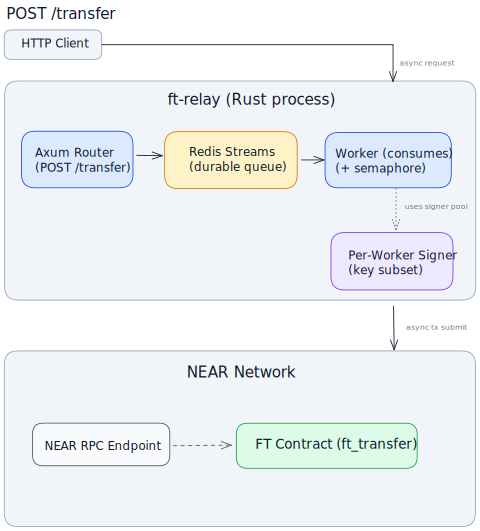

# FT Relay

A Rust-powered HTTP relay that batches NEP-141 `ft_transfer` calls into NEAR transactions. Use it whenever you need to fan-in high volumes of fungible token transfers onto NEAR with a simple HTTP interface.

---

## Features

- **Single endpoint** – `POST /v1/transfer` accepts `receiver_id`, `amount`, and an optional `memo`.
- **Signer pool** – rotate across multiple function-call access keys to avoid nonce contention.
- **Micro-batching** – pack up to `BATCH_SIZE` transfers into a single transaction while respecting the 300 TGas ceiling.
- **Async pipeline** – bounded queue + semaphore to backpressure inflight batches.
- **Sandbox-friendly** – integration suites spin up `near-sandbox`, deploy the FT contract, and verify final balances.
- **Docker-ready** – minimal two-stage container for production deployment.

---

## Architecture at a Glance



- The HTTP handler pushes requests onto a Tokio MPSC channel.
- The batcher drains the channel, groups requests, and submits one or more transactions for each batch chunk.
- Gas accounting ensures we never exceed NEAR’s 300 TGas prepaid limit (`90` transfers × `40 TGas`).
- The signer pool is backed by `near-api-rs` and can host multiple secret keys for high concurrency.

---

## Prerequisites

- [Rust](https://www.rust-lang.org/tools/install) 1.76 or newer (Rust 1.86 used in CI).
- `near-sandbox` dependencies (the integration tests download and run it automatically).

---

## Getting Started

1. **Clone and configure**

   ```bash
   git clone https://github.com/r-near/ft-relay.git
   cd ft-relay

   cp .env.example .env
   # edit ACCOUNT_ID, PRIVATE_KEYS, RPC_URL, batching knobs
   ```

2. **Run the relay**

   ```bash
   cargo run --release -- \
     --token your-ft-contract.testnet
   ```

   The server listens on `0.0.0.0:8080` unless you set `BIND_ADDR`.

3. **Send a transfer**
   ```bash
   curl -X POST http://localhost:8080/v1/transfer \
     -H 'Content-Type: application/json' \
     -d '{"receiver_id":"alice.testnet","amount":"1000000000000000000"}'
   ```
   Responses are fire-and-forget acknowledgements (`{"status":"accepted"}`).

---

## Configuration (.env)

All configuration except the FT contract ID comes from environment variables. The CLI flag `--token` remains mandatory so you can point the same deployment at different contracts.

| Variable               | Required | Description                                                                                           |
| ---------------------- | -------- | ----------------------------------------------------------------------------------------------------- |
| `ACCOUNT_ID`           | ✅       | NEAR account that owns the function-call access keys.                                                 |
| `PRIVATE_KEYS`         | ✅       | Comma-separated list of ed25519 secret keys (`ed25519:...`). Use multiple keys for higher throughput. |
| `RPC_URL`              | ✅       | NEAR RPC endpoint (sandbox/testnet/mainnet).                                                          |
| `BIND_ADDR`            | ❌       | HTTP bind address (`0.0.0.0:8080` by default).                                                        |
| `BATCH_SIZE`           | ❌       | Max logical transfers per batch (default `90`).                                                       |
| `BATCH_LINGER_MS`      | ❌       | Max time to wait for a batch to fill (default `20ms`).                                                |
| `MAX_INFLIGHT_BATCHES` | ❌       | Inflight batch semaphore (default `200`).                                                             |
| `RUST_LOG`             | ❌       | Standard Rust logging spec (`info,ft_relay=info`).                                                    |

> ⚠️ Use function-call restricted keys that can only call your FT contract. Never ship full-access secrets in production.

---

## Testing

The project includes ignored integration suites that each spin up `near-sandbox`. Run them explicitly:

```bash
# Basic single transfer
cargo test --test integrated_benchmark basic -- --ignored --nocapture

# Debug helper with verbose logging (10 transfers)
cargo test --test debug_load -- --ignored --nocapture

# Concurrent load test (100 transfers)
cargo test --test integrated_benchmark load -- --ignored --nocapture

# Bounty-scale benchmark (60k transfers / 10 minutes)
cargo test --test integrated_benchmark bounty -- --ignored --nocapture
```

Before pushing changes, run formatting and linting:

```bash
cargo fmt --all
cargo clippy --all-targets -- -D warnings
cargo check
```

---

## Docker Usage

### Run from GitHub Container Registry

```bash
docker run --rm \
  -p 8080:8080 \
  --env-file .env \
  ghcr.io/r-near/ft-relay:latest \
  --token your-ft-contract.testnet
```

### Build locally

```bash
docker build -t ft-relay:latest .
```

```bash
docker run --rm \
  -p 8080:8080 \
  --env-file .env \
  ft-relay:latest \
  --token your-ft-contract.testnet
```

The image exposes port `8080` and defaults to `RUST_LOG=info`. Override the command arguments or environment variables as needed.

---

## API Reference

### `POST /v1/transfer`

**Body**

```json
{
  "receiver_id": "alice.testnet",
  "amount": "1000000000000000000",
  "memo": "optional"
}
```

- `receiver_id` – NEAR account to receive tokens (must be registered).
- `amount` – Stringified yocto-token amount.
- `memo` – Optional memo forwarded to the FT contract.

**Response**

```json
{ "status": "accepted" }
```

HTTP `503` signals the internal queue is saturated.

---

## Troubleshooting

- **Sandbox kernel parameter warnings** – `near-sandbox` may warn about TCP buffer sizes on Linux. Adjust via `scripts/set_kernel_params.sh` if you need peak throughput.
- **Nonce errors** – Add more keys to `PRIVATE_KEYS` or ensure the signer account isn’t used elsewhere.
- **Gas exceeded** – The relay automatically chunks batches, but if you change `FT_TRANSFER_GAS_PER_ACTION`, keep `gas * BATCH_SIZE ≤ 300 TGas`.

---

## Roadmap & Caveats

- No durable queue or persistence – restarts drop in-flight transfers.
- No finality tracking – we optimistically submit and rely on NEAR RPC to process transactions.
- Idempotency and retry logic are minimal; upstream callers should implement their own safeguards.

Contributions and issue reports are welcome!
